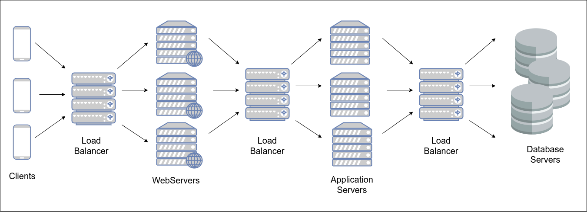

@lesson_id:load_balancer_2
@lesson_title:Load Balancer Placement
@video_url:???

@question Where can a load balancer implementation be placed in a network infrastructure?

@hint Consider the levels of the server infrastructure stack that handles requests. What are these regions and where does a load balancer fit in?

@answer Load balancers can practically be placed throughout the entire server infrastructure stack. If the basic infrastructure stack is composed of the clients, the web servers, the application servers, and the database servers, flowing in that order, we can place load balancers between each part of the stack.
- Frontend layer: sits between the clients and the web servers. This allows for more requests to be handled by the system. This is the most common placement.
- Application Layer: sits between between web servers and application servers.  Manages application server load and utilization.
- Persistence Layer: sits between application and database servers.

Essentially, a load balancer can sit between any of the sections of the infrastructure stack. If a cache server layer were to be added between the application and database servers, for example, load balancers could also be placed there.
